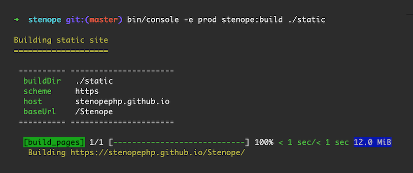

# Stenope

> The static website generation tool for Symfony.



## Why another static site generator?

We're Symfony developers that couldn't find a static website generator that bended to our needs.

We needed a way of generating static websites that:

- Doesn't impose a format, a structure or a location for the data.
- Runs in a [Symfony](symfony.com) environment.
- Allow us to develop virtually any feature we might need.

Stenope does that.

## Installation

In your existing Symfony app:

```shell
composer require stenope/stenope
```

If you plan to create a new app from scratch, you can give a try to the [Stenope Skeleton](https://stenopephp.github.io/skeleton/).

## Usage

````shell
bin/console -e prod cache:clear
bin/console -e prod stenope:build ./static
````

Your Symfony app is now a static website in: `./static`! ✨

**Next:** [learn more about Stenope's content management system](doc/loading-content.md).

## Philosophy and goals

Stenope was designed with these goals in mind:

- Stenope meets your needs, not the other way around.
- Stenope runs in any Symfony project out of the box, connects with standard Symfony components and feels natural to Symfony developers.
- Stenope is highly extensible: features can be replaced, added or removed.

## How it works

- 🔍 Stenope scans your Symfony app (like a search engine crawler would) and dumps every page into a static HTML file.
- 🛠 Stenope provides tools for loading and parsing various data sources (like local Markdown files or distant headless CMS).
- 🖌 Stenope enriches the parsed data by applying a series of processors (like Syntax Highlighting, slug generation, etc.).
- 🧲 Stenope finally hydrates your custom PHP objects with the enriched data and provides interfaces for listing and retrieving them (like an ORM would).
- ⚙️ Stenope gives you a lot of control over the whole process by providing entrypoints, interfaces and default implementations that are entirely replaceable.

## What Stenope is not

Stenope is not a ready-to-use bloging system: but you could quickly _write your own_ blog system with it!

## In-depth documentation

### Features

- [Loading and parsing content](doc/loading-content.md)
- [Supported formats](doc/supported-formats.md)
- [Supported sources](doc/supported-sources.md)
- [CLI usage](doc/cli.md)
- [Debug contents](doc/cli.md#debug)
- [Syntax highlighting](doc/syntax-highlighting.md)
- [Linking contents](doc/link-contents.md)
- [Configuring the build](doc/build-configuration.md)
- [Twig integration](doc/twig.md)

### Cookbooks

<!-- TODO - [Specifying host and base url]() -->
<!-- TODO - [Adding custom files to the build]() -->
<!-- TODO - [Data source: writing a custom Provider]() -->
<!-- TODO - [Data format: writing a custom Decoder]() -->
- [Data manipulation: writing a custom Processor](doc/cookbooks/processors.md)
- [Exposing a not found page](doc/cookbooks/not-found-page.md)
<!-- TODO - [How to automatically deploy and host a static site]() -->
