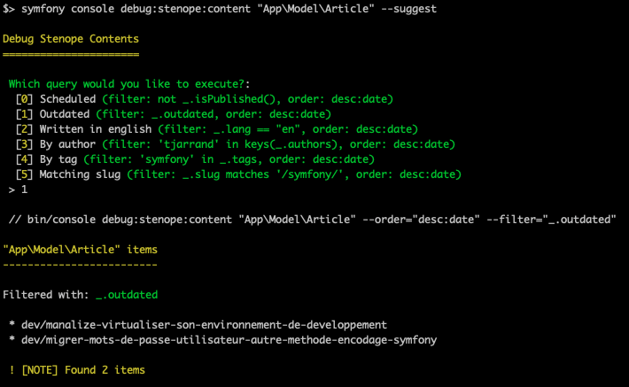

# CLI

## Build

The build command:

```shell
bin/console stenope:build [options] [--] [<buildDir>]
```

### Building into a specific directory

Use the `buildDir` argument:

```shell
bin/console stenope:build ./static
```

### Options

| Option | Description |
| -- | -- | -- |
| `--host=stenopephp.github.io` | What should be used as domain name for absolute url generation? | |
| `--base-url=/Stenope` | What should be used as base-url for absolute url generation? | |
| `--scheme=https` | What should be used as scheme for absolute url generation? | |
| `--no-sitemap` | Don't build the sitemap | |
| `--no-expose` | Don't expose the public directory | |
| `--ignore-content-not-found` | Ignore content not found errors | |

## Debug

There is a command to list, filter, sort out and display content managed by Stenope:

```shell
bin/console debug:stenope:content [options] [--] <class> [<id>]
```

E.g:

```shell
bin/console debug:stenope:content "App\Model\Article" --filter='not _.outdated' --filter='contains(_.slug, "symfony")' --order="desc:publishedAt"
```

```shell
bin/console debug:stenope:content "App\Model\Author" ogi
```

Use `--help` for more details and usage samples.

### Common queries

You can register common queries using PHP 8 attributes:

```php
namespace App\Model;

use Stenope\Bundle\Attribute\SuggestedDebugQuery;

#[SuggestedDebugQuery('Scheduled', filters: 'not _.isPublished()', orders: 'desc:date')]
#[SuggestedDebugQuery('Outdated', filters: '_.outdated', orders: 'desc:date')]
#[SuggestedDebugQuery('Written in english', filters: '_.lang == "en"', orders: 'desc:date')]
#[SuggestedDebugQuery('By author', filters: "'tjarrand' in keys(_.authors)", orders: 'desc:date')]
#[SuggestedDebugQuery('By tag', filters: "'symfony' in _.tags", orders: 'desc:date')]
#[SuggestedDebugQuery('Matching slug', filters: "_.slug matches '/symfony/'", orders: 'desc:date')]
class Article
{
    // ...
}
```

These queries will be suggested when using the debug CLI command:


and you'll be asked to choose one by using the `--suggest` option.


