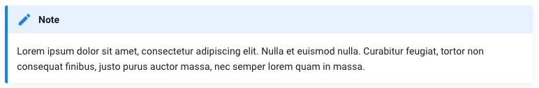

# Supported formats

Content supports many formats out of the box and you can add support for any format.

## Mardown

The Mardown format allow classic semantic writing, good for blog posts.

Markdown source files will be decoded into HTML and passed as a `content` property for denormalization.
An optional YAML formatted header can be provided at the beginning of the file to define a list of custom properties.

```markdown
---
title: "Lorem Ipsum"
publishDate: 2020-01-01
foo: true
---

# Lorem ipsum dolor sit amet

Lorem ipsum dolor sit amet, consectetur adipiscing elit. Donec egestas odio vitae sapien pharetra posuere. Aliquam pellentesque tortor hendrerit, tempor augue ut, vulputate libero. Nullam a lobortis nibh. Donec ac molestie tellus. Duis ac elit a odio sodales interdum. Cras venenatis augue sit amet lacinia ultrices. Duis gravida ac elit quis auctor.

- Lorem
- Ipsum
- Dolor
```

The default MarkdownDecoder relies on [erusev/parsedown](https://github.com/erusev/parsedown) and supports the standard Markdown features, with some additions:

- Headers: `# H1`, `## H2`, ...
- Bold: `**bold**`
- Italic: `_italic_`
- Lists : `* foo`
- Numeroted lists: `1. Foo`
- Links: `[links](https://..)`
- Images:  ``
- Quotes: `> Foo bar.`
- Inline code `` `$foo` ``
- Multilign code `` ``` ``
- Multilign highligted code `` ```php `` (see [Syntax Highlighting](syntax-highlighting.md))
- Tables
- Embed HTML
- [Admonitions](#admonitions)

### Admonitions

Admonitions, also known as call-outs, are an excellent choice for including side
content without significantly interrupting the document flow.

Admonitions are supported as described in https://python-markdown.github.io/extensions/admonition/

#### Usage

```markdown
!!! note
    Lorem ipsum dolor sit amet, consectetur adipiscing elit. Nulla et euismod
    nulla. Curabitur feugiat, tortor non consequat finibus, justo purus auctor
    massa, nec semper lorem quam in massa.
```

will generate:

```html
<div class="admonition note">
<p class="admonition-title">Note</p>
<p>
    Lorem ipsum dolor sit amet, consectetur adipiscing elit. Nulla et euismod
    nulla. Curabitur feugiat, tortor non consequat finibus, justo purus auctor
    massa, nec semper lorem quam in massa.
</p>
</div>
```

Which with proper CSS, could result into something like:



Writing CSS to render this is up to you.

#### Changing the title

```markdown
!!! note "Phasellus posuere in sem ut cursus"
    Lorem ipsum dolor sit amet, consectetur adipiscing elit. Nulla et euismod
    nulla. Curabitur feugiat, tortor non consequat finibus, justo purus auctor
    massa, nec semper lorem quam in massa.
```

### Removing the title

```markdown
!!! note ""
    Lorem ipsum dolor sit amet, consectetur adipiscing elit. Nulla et euismod
    nulla. Curabitur feugiat, tortor non consequat finibus, justo purus auctor
    massa, nec semper lorem quam in massa.
```

## HTML

The HTML format gives you full control over your content's DOM tree and Javascript integration, while still defining a list of key/value properties:

```html
<!DOCTYPE html>
<html>
<head>
    <title>Lorem Ipsum</title>
    <meta name="date" content="2019-05-25">
    <meta name="language" content="en">
    <meta name="description" content="Understanding the difference between `const` and `let`.">
</head>
<body>
    <h1>Lorem ipsum dolor sit amet</h1>

    <p>Lorem ipsum dolor sit amet, consectetur adipiscing elit. <span class="custom">Donec egestas odio vitae sapien pharetra posuere.</span> Aliquam pellentesque tortor hendrerit, tempor augue ut, vulputate libero. Nullam a lobortis nibh. Donec ac molestie tellus. Duis ac elit a odio sodales interdum. Cras venenatis augue sit amet lacinia ultrices. Duis gravida ac elit quis auctor.</p>

    <ul id="toto">
        <li>Lorem</li>
        <li class="important">Ipsum</li>
        <li>Dolor</li>
    </ul>
</body>
```

- The `<title>` is parsed as `title` property.
- The `<meta>` tags allow to define custom properties.
- The `<body>` will be passed as a `content` property.

## YAML

The YAML format is usefull for simple straightforward key/value contents:

```yaml
username: ogizanagi
name: Maxime Steinhausser
status: awesome
```

## JSON

The JSON format is an alternative the YAML format and can serve the same purpose:

```json
{
    "username": "ogizanagi",
    "name": "Maxime Steinhausser",
    "status": "awesome"
}
```

## Support custom formats

You can support any format by creating a custom Decoder that implements `Symfony\Component\Serializer\Encoder\DecoderInterface`.

See Symfony's ["How to Create your Custom Encoder"](https://symfony.com/doc/current/serializer/custom_encoders.html).
